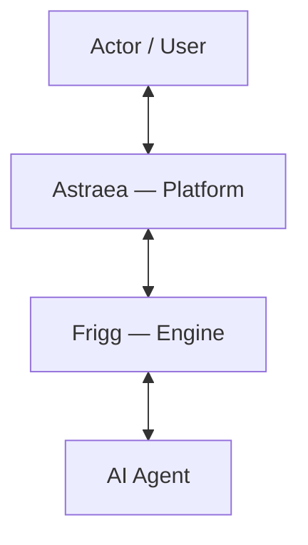
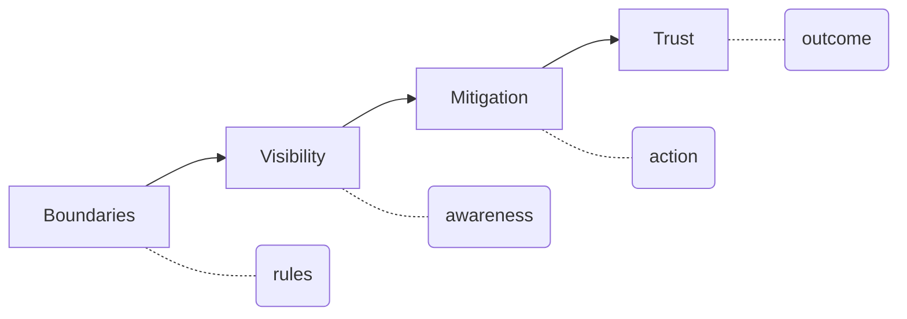

# Frigg-Astraea — Project Manifest

## The Problem

AI agents act on behalf of people — calling tools, making decisions, accessing data. But today:

- You can't predict what an agent will do. The same input can lead to different actions.
- You can't see why it did something. Frameworks log that something happened, not the reasoning behind it.
- It moves too fast. By the time you could review one action, many more have already happened.
- Visibility is an afterthought. Frameworks prioritise what agents can do, not whether you can see them doing it.
- There's no standard. Every framework reports differently, if at all.
- The reasoning is hidden. Even with logs, you can't see why an agent chose one action over another.

The result: the user is downstream of an autonomous system they cannot see into, cannot constrain upfront, and have no structured way to intervene when something goes wrong.

Existing solutions are either enterprise platforms (heavy) or narrowly focused on one concern — guardrails without visibility, or observability without action.

## Vision: Astraea

AI is transformative. We embrace it fully — and we build the conditions for it to thrive responsibly.

Astraea is the ecosystem where people and AI agents work together with confidence. AI agents run freely within constraints, their actions are visible to those responsible, and intervention is always possible before harm compounds.

The user can be confident in their use.

## Solution: Frigg & Astraea

**Frigg** is the engine. It handles the mechanics:
- Setting and configuring boundaries.
- Collecting and surfacing logs.
- Configuring and executing mitigation actions.

**Astraea** is the platform. It brings the pieces together to create trust:
- Assigning weights and severity.
- Correlating information across pillars.
- Iterative learning (later versions) — refining towards a truth the actor can accept.

Think of it this way:
- **Frigg** = primitives (rules, logs, actions) — deterministic, configurable, fast.
- **Astraea** = intelligence layer (weighting, correlation, learning) — opinionated, evolving, where trust is synthesised.

## Pillars

Three pillars, layered and sequential — each builds on the one before. Frigg implements them; Astraea synthesises across them.

1. **Boundaries** — defines what an agent is allowed to do. Rules, permissions, constraints. Enables predictability.
2. **Visibility** — observes what is actually happening within those boundaries. Enables awareness.
3. **Mitigation** — empowers the user to intervene based on what visibility reveals. Enables control.

## Design Principles

1. **The human is always in charge** — authority is delegated, never assumed.
2. **The cost of intervention must be lower than the cost of the error** — only intervene when it's worth it.
3. **The platform always explains itself** — every decision is grounded in evidence. No action without facts to support it.
4. **Response matches severity** — the platform's reaction is proportional to the risk.
5. **Slow down only when it matters** — the platform can take more time to make a better decision.

## Non-Goals

- Not a replacement for the AI agent itself.
- Not an AI framework or orchestrator.
- Not an observability or telemetry product — visibility serves the pillars, it is not the product itself.
- Not a firewall or rigid policy enforcement engine — the platform enforces a charter defined by the human, not blind rule matching.

## Ground Rules

- Open source from day one.
- The platform must allow the system to move freely but safely.
- Scope discipline — resist feature creep beyond the three pillars.

## Where We Fit

The space has pure guardrails (no visibility), pure observability (no action), and enterprise platforms (not lightweight). Frigg-Astraea brings it together: boundaries + visibility + mitigation in a single platform, with a human-in-the-loop philosophy rather than automated blocking.

## What We've Decided

**Who it's for:** Both developers building agents and teams operating them, with a focus on operators.

**What v1 looks like:**

1. **Boundaries** — a rules engine that reads configuration (file or memory) and interprets it into enforceable rules.
2. **Visibility** — captures activity logs; the actor can search and review them (raw or aggregated) through a UI.
3. **Mitigation** — alerts when rules are broken; manual or automatic mitigation actions based on severity.

**Open source governance:** Single maintainer, later a committee. License: MIT or Apache 2.0 (TBD).

**How we know it's working:**

1. A non-technical user running an agent can receive warnings about potential risks and take action.
2. A technical or non-technical user can receive notifications, review and revise the audit logs, change the rules or take action, for future conversations.
3. A team deploys an agent with confidence because boundaries are defined upfront.
4. An agent breaks a rule and the actor is notified before damage compounds.
5. An operator can review the audit log leading to an incident in under a minute.
